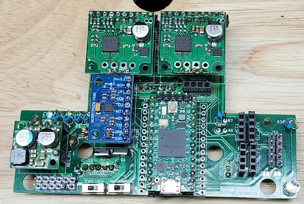
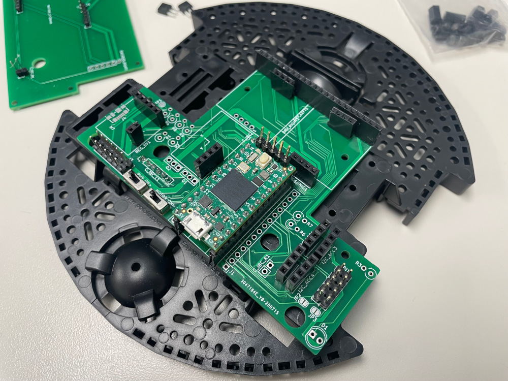
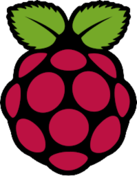
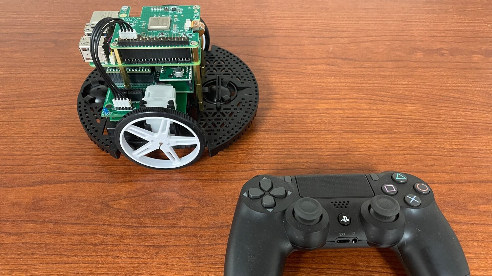
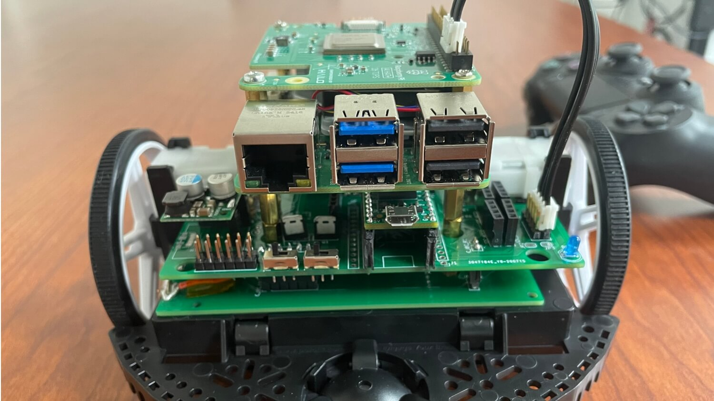
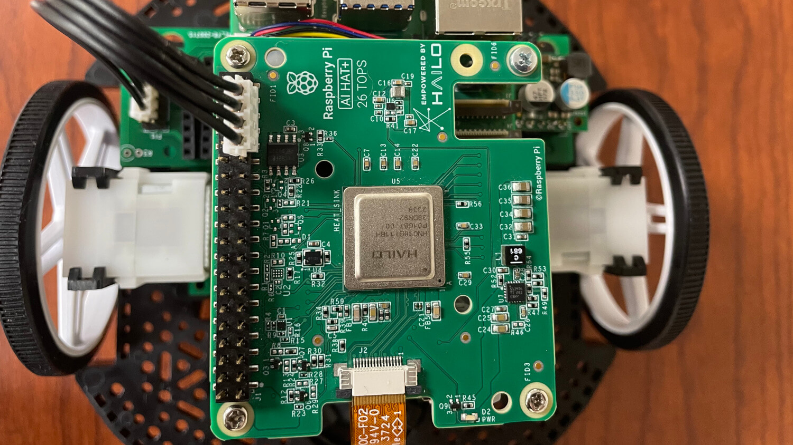
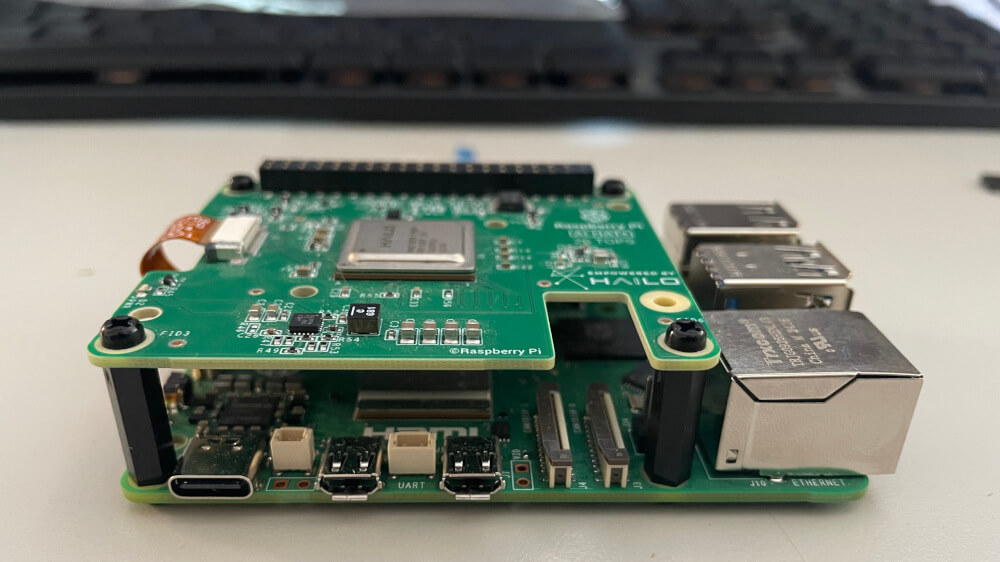

<!-- TABLE OF CONTENTS -->
<details>
  <summary>Table of Contents</summary>
  <ol>
    <li>
      <a href="#about-the-project">About The Project</a>
      <ul>
        <li><a href="#built-with">Built With</a></li>
      </ul>
    </li>
    <li>
      <a href="#getting-started">Getting Started</a>
      <ul>
        <li><a href="#prerequisites">Prerequisites</a></li>
        <li><a href="#installation">Installation</a></li>
      </ul>
    </li>
    <li><a href="#usage">Usage</a></li>
    <li><a href="#roadmap">Roadmap</a></li>
    <li><a href="#contributing">Contributing</a></li>
    <li><a href="#license">License</a></li>
    <li><a href="#contact">Contact</a></li>
    <li><a href="#acknowledgments">Acknowledgments</a></li>
  </ol>
</details>

# Common Platform

<!-- ABOUT THE PROJECT -->
## Rose City Robotics Fork - Portland Area Robotics Society Project

<br>
<p align="center">
  
</p>
<br>

This project implements a complete robotics platform built on the Pololu Romi Chassis Kit, featuring a custom carrier PCB that integrates all components into a compact, efficient design. The platform combines hardware, firmware, and software to create a fully functional autonomous robot.

<br>
<p align="center">
  <a href="https://portlandrobotics.org/home.php?link_id=1">
    
  </a>
<br>
<br>

**Hardware Components:**
- **Pololu Romi Chassis Kit** - Robust base platform with encoders and caster
- **Custom PARTS CRP Board** - Integrated carrier PCB with all connections
- **Teensy 4.0 Microcontroller** - High-performance ARM Cortex-M7 processor
- **TB9051FTG Motor Drivers** - Dual brushed DC motor control
- **MPU-9250 9DOF IMU** - Nine-axis motion sensing for navigation
- **Raspberry Pi** - Main computer for ROS2 and autonomous functionality
- **Power Management** - 5V regulator and battery voltage monitoring

<br>
<p align="center">
  
</p>
<br>

**Current Implementation:**
The platform now features a complete ROS2 integration with micro-ROS running on the Teensy 4.0, enabling real-time communication between the Raspberry Pi and the robot's sensors and actuators. The system supports autonomous navigation, sensor fusion, and closed-loop control, making it an ideal platform for robotics education and development in the Portland Area Robotics Society.

<p align="right">(<a href="#readme-top">back to top</a>)</p>

### Built With

* [![CPP][cpp]][cpp-url]
* [![C][c]][c-url]
* [![Python 3][python]][python-url]
* [![PlatformIO][platformio]][platformio-url]
* [![Arduino][arduino-ide]][arduino-url]
* [![KiCadEDA][kicad]][kicad-url]
* [![ROS][ros]][ros-url]

<p align="right">(<a href="#readme-top">back to top</a>)</p>

<!-- GETTING STARTED -->
## Getting Started

### Prerequisites

* All the required parts from the BOM on hand. [BOM](/BOM.csv)
* Windows/Mac/Linux PC
* Soldering supplies


### Installation

Welcome to the setup guide for the Common Robotics Platform. Follow these steps to prepare your hardware and software for an exciting journey into robotics!

#### 1. Solder Your PARTS CRP Board
Soldering the PARTS CRP board is the first crucial step. Follow the instructions carefully to ensure a successful setup.

- **Interactive BOM**: Utilize the [Interactive BOM](https://htmlpreview.github.io/?https://github.com/rosecityrobotics/common_platform/blob/master/hardware/romi_board/bom/ibom.html) for an easier soldering process.
- **Headers for Connectivity**: We recommend using headers for connections between boards. This makes disassembly possible if needed.
  - Use female (socket) headers on the bottom board.
  - Use male (pin) headers on the top board. These are typically included with all breakout boards.
- **MOSFET Orientation**: Ensure the correct orientation of the MOSFETs during soldering.
- **Resistor for Battery Voltage Divider**: Choose the resistor based on your battery choice:
  - Use a 2M ohm resistor (R1) for 6 AA batteries.
  - Opt for a 3M ohm resistor if using higher voltage batteries like 2 LiPo batteries.
  - Install a >100 pf capacitor across R2 to address voltage drop issues.
- **Teensy Board Modification**: For battery power, cut the trace on the Teensy board. Refer to the note "Cut to separate VIN from VUSB" on the [Teensy 4.0 Back Side](https://github.com/rosecityrobotics/common_platform/blob/master/hardware/main_schematic.pdf) image.
- **Resistor Values**: The values of R4, R5, R8, R9 depend on your specific usage. For I2C, 4.7k is appropriate.
- **Schematic**: Refer to the [Main Schematic](https://github.com/rosecityrobotics/common_platform/blob/master/hardware/main_schematic.pdf) for detailed understanding.

#### 2. Solder Accessories
Solder accessories like the Inertial Measurement Unit (IMU), ensuring proper orientation and connection.

#### 3. Assemble the Pololu Romi Chassis
The Pololu Romi Chassis forms the physical structure of your robot.

- Follow the [Romi Chassis Assembly Guide](https://www.pololu.com/docs/0J68/4) for detailed instructions on assembling the chassis.

###  Direct Connection to Raspberry Pi
Connect your micro HDMI cable to your Pi and monitor, and a keyboard to the USB-A port.

###  Ubuntu Login on Raspberry Pi
- **User:** `rcr`
- **Password:** `siliconforest`

###  Host Settings
The host has been preset for you as `rcr00_` with your specific ID. To update the hostname:

1. Tell cloud-init to preserve your hostname:
   ```bash
   sudo nano /etc/cloud/cloud.cfg
   ```
   Set `preserve_hostname: true` and save the file

2. Update the hostname for the robot:
   ```bash
   sudo nano /etc/hostname
   ```
   Change `rcr001` to `rcr00n` (replace n with the number)

3. Update the hosts file:
   ```bash
   sudo nano /etc/hosts
   ```
   Change `rcr001` to `rcr00n`

4. Set the hostname:
   ```bash
   sudo hostnamectl set-hostname rcr00n
   ```

5. Reboot to make sure the changes have taken effect:
   ```bash
   sudo reboot
   ```

###  Network Configuration

Set custom IP address and set up networking:

1. Edit the netplan configuration:
   ```bash
   sudo nano /etc/netplan/50-cloud-init.yaml
   ```

2. Add the following configuration (replace `n` with your robot number):
   ```yaml
   network:
     version: 2
     wifis:
       wlan0:
         optional: true
         dhcp4: no
         addresses:
           - 192.168.1.n/24
         routes:
           - to: default
             via: 192.168.1.1
         nameservers:
           addresses: [8.8.8.8, 1.1.1.1]
         access-points:
           "robot_overlord_wifi":
             password: "siliconforest"
           "RoseCityRobotics":
             password: "QW260go80.."
   ```
   **Note:** `n` = the robot number

3. Apply the network configuration:
   ```bash
   sudo netplan apply
   ```

###  Testing SSH Connection

1. ** On the Pi:** Make sure the IP address is assigned:
   ```bash
   hostname -I
   ```

2. **🖥️ On the other computer:** Connect via SSH:
   ```bash
   ssh rcr@192.168.1.n
   ```
   Replace `n` with your robot number.

### Accessing the Pi  from your development machine 🖥️ via SSH
Both the external device and the robot must be on the same WiFi for SSH to work. Use the static IP address of your Pi to SSH. The command will look something like `ssh rcr@192.168.1.n` where `n` is your ID, for example `ssh rcr@192.168.1.9`.

###  Teensy Programming - Use Arduino CLI

**What we're doing:** We'll set up the Arduino CLI tool on the Raspberry Pi to compile and upload firmware to the Teensy microcontroller. This allows us to program the robot's brain (Teensy) directly from the command line without needing a graphical interface.

**Why Arduino CLI:** The Arduino CLI is the official command-line tool that provides all the functionality of the Arduino IDE but runs entirely in the terminal. This is perfect for our setup since we're working remotely via SSH on the Raspberry Pi.

Arduino provides an official `arduino-cli` tool. You can compile and upload Arduino code for a Teensy entirely from the Ubuntu command line. You will do this from the Raspberry Pi (after connecting via SSH).

#### 1. **Install Arduino CLI:**
```bash
curl -fsSL https://raw.githubusercontent.com/arduino/arduino-cli/master/install.sh | sh
mv bin/arduino-cli ~/.local/bin/
```

#### 2. **Configure Arduino CLI:**
```bash
arduino-cli config init
```

#### 3. **Add Teensy board support:**
```bash
arduino-cli core update-index
arduino-cli core install teensy:avr --additional-urls https://www.pjrc.com/teensy/package_teensy_index.json
```

#### 4. Transfer micro-ROS Arduino Library to Raspberry Pi

The required micro-ROS Arduino library is available in the repository: `firmware/libraries/micro_ros_arduino.zip` so we will  pull the repository to Raspberry Pi  to access the file.

**What we're doing:** We need to transfer the micro-ROS library GitHub to the Raspberry Pi that's connected to your robot. The Raspberry Pi serves as the main computer that will compile and upload firmware to the Teensy microcontroller.

🖥️ From your development machine
```bash
ssh rcr@192.168.1.n
```

** From your Raspberry Pi** in the common_platform directory:

First update your directory with the latest changes from the https://github.com/roseCityRobotics/common_platform repository including the .zip file you'll need next.
```bash
git pull origin main
```

#### 5. Setup micro-ROS Library and Compile Firmware

**What we're doing:** Now we're working directly on the Raspberry Pi to set up the micro-ROS library and compile the robot's firmware. The Raspberry Pi will handle the compilation process and then upload the compiled code to the Teensy microcontroller.

** From the Raspberry Pi (RPi):**

a. Set up Arduino libraries directory:
   ```bash
   cd ~
   mkdir -p Arduino/libraries/
   cp repos/firmware/libraries/micro_ros_arduino.zip Arduino/libraries/
   cd ~/Arduino/libraries/
   ```

b. Install unzip and extract the micro-ROS library:
   ```bash
   sudo apt update
   sudo apt install unzip
   unzip micro_ros_arduino.zip
   ```

c. Navigate to the common_platform repository, update it, and place the arduino-cli config files in the correct place
  ```bash
  cd ~/repos/common_platform/
  git checkout main
  git pull
  scripts/place_arduino-cli_config.sh
  ```

d. Navigate to firmware directory and create build folder:
   ```bash
   cd ~/repos/common_platform/firmware/closed_loop/
   mkdir build
   cd build
   ```

e. Compile the firmware for Teensy 4.0:
   ```bash
   arduino-cli compile --fqbn teensy:avr:teensy40 --build-property build.usbtype=USB_DUAL_SERIAL --build-path . ../closed_loop.ino
   ```

f. Find the Teensy device (first power the Teensy - i.e. put in the lower-half batteries):
   ```bash
   SERIAL_TEENSY_DEVICE=`find /dev/serial/by-id/ -name "usb-Teensyduino*if00"|head -1`
   echo "-> Performing soft reset (baud = 134 hack). $SERIAL_TEENSY_DEVICE"
   ```

g. Reset Teensy into programming mode:
   ```bash
   stty -F $SERIAL_TEENSY_DEVICE 9600
   stty -F $SERIAL_TEENSY_DEVICE 134
   ```

h. Verify Teensy is ready and upload firmware:
   ```bash
   lsusb | grep Teensy; echo "-> Should be ready to program…"
   sudo teensy_loader_cli -v --mcu=TEENSY40 closed_loop.ino.hex
   ```

<p align="right">(<a href="#readme-top">back to top</a>)</p>

## Usage

This section provides practical examples of how to use the Common Robotics Platform effectively. We'll start with a basic test to ensure your setup is functioning correctly.

### Starting with the Basic Test

1. **Flash the Teensy 4.0 Board:**
   Begin by flashing the Teensy 4.0 board with the basic test code found in the repository at `/firmware/basic_test/basic_test.ino`. This initial test is crucial for validating your setup.

2. **Expected Behavior:**
   Upon successful flashing, the robot should exhibit a simple behavior pattern: moving forward, pausing, and then moving backward.

<p align="right">(<a href="#readme-top">back to top</a>)</p>

### Assembly Images

*Mobile base platform - unassembled components*


*Assembled chassis with controller*



*Custom PCB showing integrated motor drivers and controller connections*



*Completed chassis - top view with Raspberry Pi AI HAT+*



*Raspberry Pi 5 with AI HAT+*



*Side view with LiDAR sensor mounted*


<p align="right">(<a href="#readme-top">back to top</a>)</p>

See the [open issues](https://github.com/rosecityrobotics/common_platform/issues) for a full list of proposed features (and known issues).

<p align="right">(<a href="#readme-top">back to top</a>)</p>

### Thank you PARTS


*Portland Area RoboTics Society (PARTS)*
Our work is based on the [PARTS Common Platform](https://github.com/portlandrobotics/common_platform)

<!-- CONTRIBUTING -->
## Contributing

Contributions are what make the open source community such an amazing place to learn, inspire, and create. Any contributions you make are **greatly appreciated**.

If you have a suggestion that would make this better, please fork the repo and create a pull request. You can also simply open an issue with the tag "enhancement".
Don't forget to give the project a star! Thanks again!

1. Fork the Project
2. Create your Feature Branch (`git checkout -b feature/AmazingFeature`)
3. Commit your Changes (`git commit -m 'Add some AmazingFeature'`)
4. Push to the Branch (`git push origin feature/AmazingFeature`)
5. Open a Pull Request

<p align="right">(<a href="#readme-top">back to top</a>)</p>


<!-- LICENSE -->
## License

Distributed under the MIT License and the Solderpad Hardware License v2.1. See [LICENSE.txt][license-url] for more information.

<p align="right">(<a href="#readme-top">back to top</a>)</p>


<!-- MARKDOWN LINKS & IMAGES -->
<!-- https://www.markdownguide.org/basic-syntax/#reference-style-links -->
[contributors-shield]: https://img.shields.io/github/contributors/portlandrobotics/common_platform.svg?style=for-the-badge
[contributors-url]: https://github.com/portlandrobotics/common_platform/graphs/contributors
[forks-shield]: https://img.shields.io/github/forks/portlandrobotics/common_platform.svg?style=for-the-badge
[forks-url]: https://github.com/portlandrobotics/common_platform/network/members
[stars-shield]: https://img.shields.io/github/stars/portlandrobotics/common_platform.svg?style=for-the-badge
[stars-url]: https://github.com/portlandrobotics/common_platform/stargazers
[issues-shield]: https://img.shields.io/github/issues/portlandrobotics/common_platform.svg?style=for-the-badge
[issues-url]: https://github.com/portlandrobotics/common_platform/issues
[license-shield]: https://img.shields.io/badge/license-mit_%26_solderpad-brightgreen?style=for-the-badge
[license-url]: https://github.com/portlandrobotics/common_platform/blob/master/LICENSE.txt
[arduino-ide]: https://img.shields.io/badge/Arduino_IDE-00979D?style=for-the-badge&logo=arduino&logoColor=white
[arduino-url]: https://www.arduino.cc/en/software
[cpp]: https://img.shields.io/badge/C%2B%2B-00599C?style=for-the-badge&logo=c%2B%2B&logoColor=white
[cpp-url]: https://en.wikipedia.org/wiki/C%2B%2B
[c]: https://img.shields.io/badge/C-00599C?style=for-the-badge&logo=c&logoColor=white
[c-url]: https://en.wikipedia.org/wiki/C_(programming_language)
[python]: https://img.shields.io/badge/Python-3776AB?style=for-the-badge&logo=python&logoColor=white
[python-url]: https://www.python.org/
[platformio]: https://img.shields.io/badge/PlatformIO-F5822A.svg?style=for-the-badge&logo=PlatformIO&logoColor=white
[platformio-url]: https://platformio.org/
[kicad]: https://img.shields.io/badge/KiCad-314CB0.svg?style=for-the-badge&logo=KiCad&logoColor=white
[kicad-url]: https://www.kicad.org/
[ros]: https://img.shields.io/badge/ROS-22314E.svg?style=for-the-badge&logo=ROS&logoColor=white
[ros-url]:https://www.ros.org/
